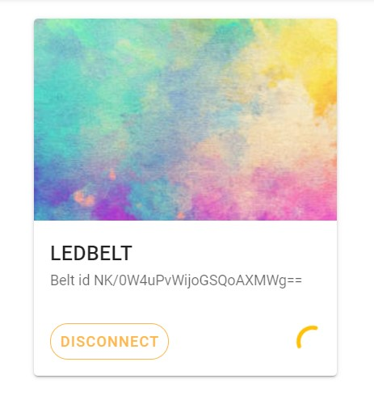

# MOTORCYCLE-LED-BELT-WITH-BLE


[](https://lbesson.mit-license.org/)
[](https://app.netlify.com/sites/ledbelt/deploys)

<br />
<p align="center">
  <a href="https://github.com/robindeleu/MOTORCYCLE-LED-BELT-WITH-BLE">
    
  </a>
  <h3 align="center">MOTORCYCLE-LED-BELT-WITH-BLE</h3>
  <p align="center">
    An awesome led belt to use!
  </p>
</p>

<details open="open">
  <summary>Table of Contents</summary>
  <ol>
    <li><a href="#Group-members">Group members</a></li>
    <li><a href="#Project-information"> Project information</a></li>
    <li><a href="#Regulations">Regulations</a></li>
    <li><a href="#Week-report">Week report</a></li>
    <li><a href="#Frontend">Frontend</a></li>
    <li><a href="#Arduino">Arduino</a></li>
    <li><a href="#Built-With">Built With</a></li>
    <li><a href="#Authors">Authors</a></li>
    <li><a href="#License">License</a></li>
  </ol>
</details>

## Group members

* Emma Dossche
* Robin Deleu
* Roelten Jacobs

## Project information

The goal of the project is to increase the visibility of vulnerable road users. It is not stated in advance which technologies we should use. We choose to create an “autonomous” system for this, which tries to make the user more visible using led's. For this we looked at what is allowed by law. We have created an entire website and app that works fully functional (apart from sending data). We also have an arduino nano with BLE that sends data to the frontend, but also sends data to an arduino uno via serial communication. It sends RGB values and brightness level to the led's. Which in turn adopts the color values but also changes the brightness. In the end, we briefly looked at a theoretical design to practically integrate all electronics into 1 system.

## Regulations

The legislation for wearing lighting on clothes for cyclists and motorcyclists on public roads in Belgium is briefly mentioned in [this document (click here)](./Regulations.md).

## Week report

[In this document](./Report.md) you find the report of the meetings from past weeks.

## Frontend

[This is the link](https://ledbelt.netlify.app/) to the website that you can use to connect to you're ledbelt.
In the website you can create or sign in with a user. After login you are able to see all data, connect to ledbelts,...
If you don't login you're not able to do anything on the site.
The data you can see is the temperature, humidity. There is also functionality to create you're own color and change the brightness but this code is not ready yet on the frontend and arduino.
There is also a possibility to install the "app" like a PWA.

### Setting up the project

To setup the frontend you will need npm and/or Yarn.
To install all dependencies you must run these commands in the frontend directory:

```bash
npm install
```

```bash
yarn install
```

Once you did this you can serve or build the project with following commands in the frontend directory:

To serve:

```bash
yarn run serve
```

To build:

```bash
yarn run build
```

After this you must see this in the console. And you can go to localhost:8080 in you're browser.


### Register

[](./img/register.jpg)

Here you will see that you have to enter some information such as your name, surname, email and finally your password.
To ensure that everything runs smoothly, we have chosen to check whether an email address exists (correct format), if not, it will give a "red" error message that says it is not the correct format. Even if you choose a password, it must be longer than 12 characters for security rules. If you want to check if the password you entered is correct when you click on the eye, it will appear instead of you seeing dots. If you click on register you will be logged in. If you are not logged in, you cannot do anything on the site and you will always be redirected to the login page.

### Login screen

[](./img/login.jpg)

Here you will see that you have to enter some information such as your email and password.
To ensure that everything runs smoothly, we have chosen to check whether an email address exists (correct format), if not, it will give a "red" error message that says it is not the correct format. Even if you choose a password, it must be longer than 12 characters for security rules. If you want to check if the password you entered is correct when you click on the eye, it will appear instead of you seeing dots. If you click on log in, you will be logged in. If you are not logged in, you cannot do anything on the site and you will always be redirected to the login page. Even if your password or your email address is wrong but it is in the system, it will give you a message to inform you that you may have made a typo when logging in.

### Home screen

[](./img/home.jpg)

Here, just after you have logged in, you will see a default screen that says that you have not yet connected a device. To connect, click on the + button. Then you will see a list of only ledbelt devices in your area. To connect, press the device you want to connect to. Once this is done, a ticket will be automatically created for your device. It may take a while to get the data from your device so you will see a circle that will keep rotating until you have your data available.

[](./img/laden.jpg)

Once you have your data, you will be able to see the temperature, humidity and battery level in detail. You will also see that you can adjust the color of your LEDs and also the brightness. At the moment this is only layout and unfortunately the full functionality is not yet available. This is certainly something for the future.
If you want to disconnect, just press the disconnect button and it will disappear from your page and disconnect in the background.

[](./img/detail-info.jpg)

### History screen

[](./img/history.jpg)

Here, just after you have logged in, you will see a default screen that says that you have not yet connected a device. To view the history of devices you have ever connected to, click on the returning clock, here you will find it. If you hover over the button you will also be able to read this.
Here you actually see a list of all devices that are stored in the Vuex store that you have ever been connected to. You can change what should be in the history by pressing the delete button. Just remember once you delete something it cannot be brought back.

## Arduino

.

This is the theoretical scheme. On the arduino nano there is a program running that sends the lightsensor value, temperature, humidity and battery level over bluetooth.
On the arduino uno there is a program running that listens to the serial interface and changes the color of the LED's or brightness.

### Setting up the Arduino project

Here you must to make sure you installed all library's before you compile the code to the arduino's. You need to install 4 library's, they can be found in the library manager or you can download them as ZIP files and import them to the arduino IDE.

* [Adafruit_DMA_neopixel_library](https://github.com/adafruit/Adafruit_NeoPixel/archive/master.zip)
* [Arduino_APDS9960](https://www.arduino.cc/reference/en/libraries/adafruit-apds9960-library/)
* [Arduino_HTS221](https://www.arduino.cc/en/Reference/ArduinoHTS221)
* [ArduinoBLE](https://www.arduino.cc/en/Reference/ArduinoBLE)

### Code explanation

* Arduino nano: The arduino nano is used for the Bluetooth communication. It sends Temperature, humidity and battery level (analog pin 0) to the client if a device connect with it. It also send RGB values and brightness values to the arduino uno.
* Arduino uno: The arduino uno receive the RGB and brightness values from the arduino nano and use that data to really change color and brightness on the adafruit neopixel led's on pin 8.

## Built With

* [Vue](https://vuejs.org/)
* [Vuetify](https://vuetifyjs.com/en/)

## Authors

* **Emma Dossche** - *Student VIVES University of Applied Sciences*
* **Robin Deleu** - *Student VIVES University of Applied Sciences*
* **Roelten Jacobs** - *Student VIVES University of Applied Sciences*

## License

This project is licensed under the MIT License see the [LICENSE.md](LICENSE.md) file for details.
